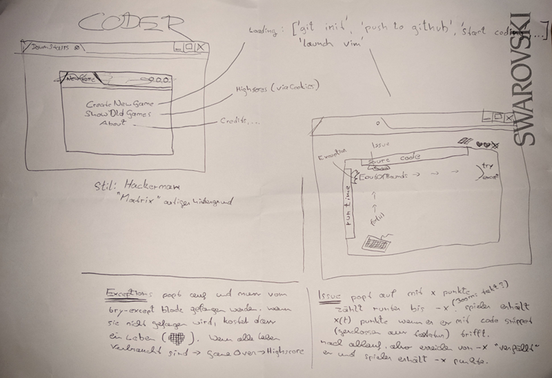
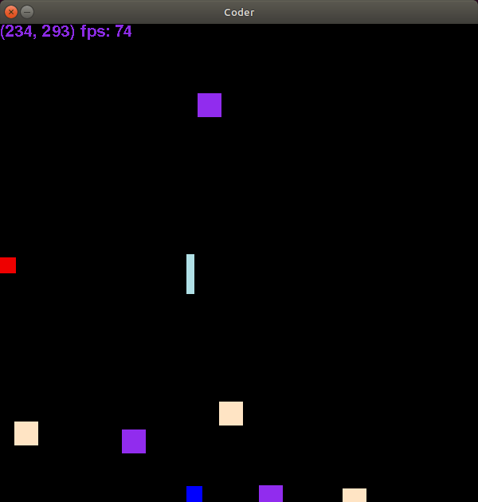
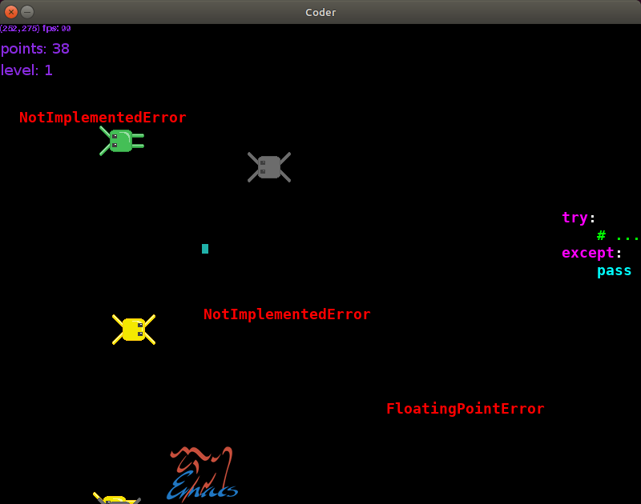
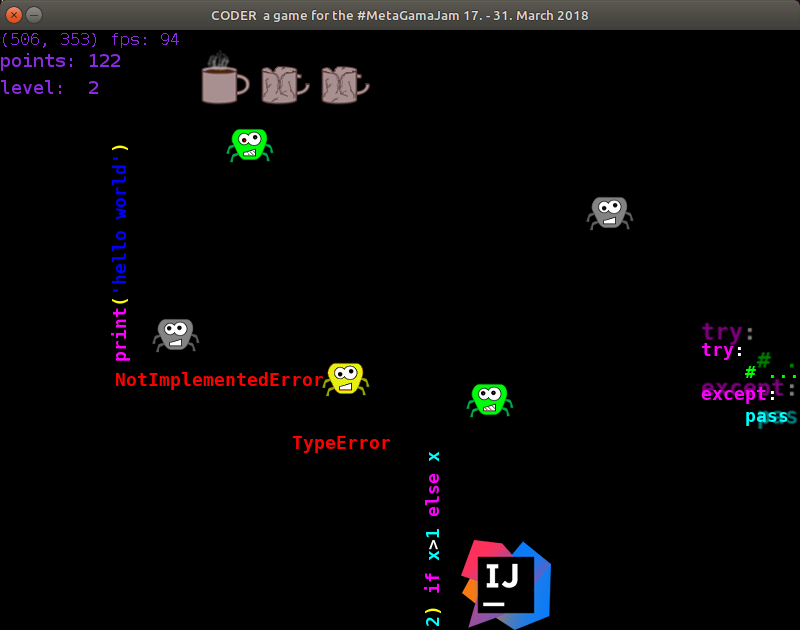

Meta Game Jam 2018
==================

DRAFT DRAFT DRAFT DRAFT DRAFT
=============================

Just a note: this is my first blog post about my first (published) game.

What is the MetaGameJam?
------------------------

The [#MetaGameJam](https://twitter.com/hashtag/MetaGameJam) is a coding
challenge on [itch.io](https://itch.io/) hosted by [Xavier
Ekkel](https://xavierekkel.itch.io/). The participants had two weeks (from
2018-03-17 to 2018-03-31) to develop a meta game.  A meta game as defined by
Xavier for the MetaGameJam is a game about games or more specific a game that:

- comment on / deconstruct / parody / satire game design, game mechanics, games development, or game culture; and/or
- heavily feature the use of meta-references (such as breaking the fourth-wall) or other metafiction elements; and/or
- provide a level of abstraction above an existing 'game' (e.g. gamification, ARGs, analysing opponents/strategies in esports)

My MetaGameJam Story
--------------------

A friend [Daniel Nimmervoll](https://github.com/Nimmda) created an
[itch.io account](https://thinkdownstairs.itch.io/) for us and told me, that
he has signed us up for the MetaGameJam! My first reaction was like "wow, good
idea, lets do it!" my second reaction was more like "wtf, how we should handle
that?".

My starting conditions for the jam were far from perfect because my girlfriend
was about to leave here flat and move to mine in exactly that two weeks. In my
experience relocating is a lot of work and time consuming. Beside that I had a
stressful time at my day job.

Spoiler: Everything turned out to be handleable. Relocation was really relaxed
and day job was ok.

We started our work on the game jam with a short brainstorming. We quickly came
up with the main idea: a two axis arcade game ('cause that seemed doable for us;
we have never published a game before!). We wanted to make it as a browser game,
but neither me nor Daniel had experience with html+js. We tried it anyways ...
for about 15 minutes. After that 15 minutes of desperate javascript googling,
copying and pasting we decided to stick with
[python](https://www.python.org/) and [pygame](https://www.pygame.org/docs/),
and don't do a browser game. A windows and of course linux game must be enough.

 <small>First sketch of our game "coder"</small>

Then we started with development. From scratch. Daniel started with a prototype of
the main game mechanics and I started with some animations. I am not an artist,
I am not a drawer, I am a programmer. I do not like drawing very much,
especially on my computer. To be more precise: I try to avoid using my computer
mouse whenever possible :-)

But we made good progress in the first few days of the jam. I learned a lot
about the pygame sound system, how to use [gimp](https://www.gimp.org/) and
[audacity](https://www.audacityteam.org/) and we had a lot of fun discussing
features of the game.

 <small>First screenshot of our game "coder"</small>

After one week we had a more or less playable game but there were still lot of
missing features.

Having a playable game is dangerous! You have to be very strict with yourself to
not play but to develop your game.

In the second week we did a lot of balancing and added a bunch of features like
a menu, a highscore screen, a select-your-editor-dialog, splash screens, credits
screen and a nice (but hopefully never seen by anyone) bug report screen.

{style="max-width: 49%;"}
{style="max-width: 49%;"}
 <small>More screenshots of our game "coder"</small>

On the last day we had a more or less finished game. But we made one big
mistake! **We had never tried it on Windows!** (We both use linux on our
personal computers). As you might guess are some differences between windows
and liunx. We had to find out how [pyinstaller](https://www.pyinstaller.org/) (a
great tool btw!) works on windows. We had to set up older linux systems with 32
and 64 bit, we had to test everything, we had to learn how to upload to itch.io,
we had to ... and everything in the last few hours. I felt really really
stressed.

